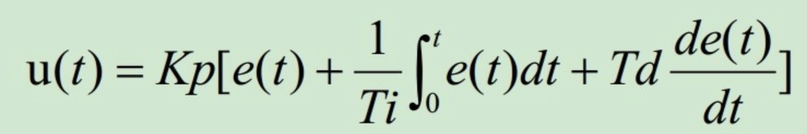
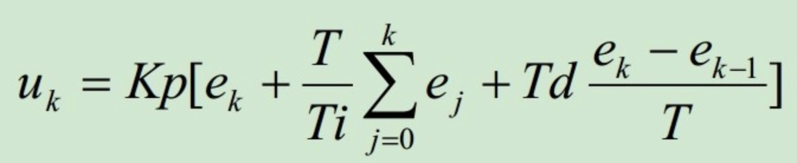
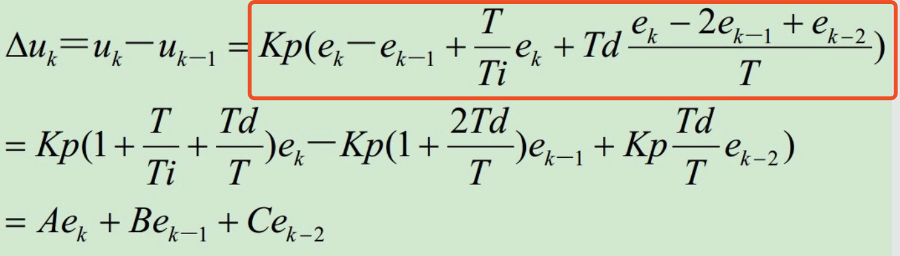

### PID介绍

#### why - 在讲是什么之前，先举个(也许不太恰当的)🌰来说说为什么需要PID

假设我们在烧水，我们现在希望把水控制在60度，一种简单粗暴的解决方案：当我们发现水温超过了60度我们就打开开关(假设目前只有最大功率[打开开关]和0功率[关闭开关])，结果打开开关后功率太大，水温立马超过了60度，我们又立刻关掉开关，这个时候水温很快就掉到60度以下。很显然，这个方案并不能稳定地将水温控制在60度，很容易在60度上下形成波动很大的曲线。

因此，我们需要一个方案，能够稳定控制水温。更直观地就反映在，如何控制某一个时刻的加热功率，让水温能够保持在目标温度上。

#### how - 如何解决上面场景的问题呢

相信大家很快可以想到，当刚开始烧水的时候，离目标温度比较远，我们就把功率开大一点，当离目标温度越来越近后，我们就逐渐调小功率。所以我们需要建立一个t时刻的烧水功率关于目标温度和当前温度的函数，用来计算t时刻应该有的烧水功率。

#### what - pid是什么

上述🌰中，t时刻的烧水功率我们设定用u(t)表示，t时刻目标温度和当前温度的差值用e(t)表示，PID的公式可以表示为：



可以看到公式分为三部分，即P、I、D，简单理解下上面三部分：

P：比例，可以看到该部分是与e(t)的一次函数关系，从🌰上来理解就是，与目标温差越大的时候，就会让输出功率越大

其中Kp为比例系数

I：积分，该部分主要是e(t)关于时间t的积分，假设当加热到50度的时候，此时比例部分算出来的加热功率带来的加热速度与自然散热速度相等了，那此时水温就会一直停留在50度（D此时也无法起到作用，因为e(t)变化速率此时趋近于0），积分的作用就可以体现出来了，此时积分值不断增大，会反应在功率上，从而使水温可以超过50度（即：**消除静差**）

其中Ti为积分时间常数（本质上就是一个带单位的常数，目的是为了配平量纲）

D：微分，即在t时刻e(t)的变化趋势，起到反向抑制的作用，使得最终温度能够趋近稳定在目标温度上，而不是有幅度的波动

其中Td为微分时间常数（同样是一个带单位的常数）


### PID实现

#### 位置式PID

假设采样间隔为T（T越小越精确），u<sub>k</sub>为第k次采样时的输出，代入PID原始公式，则可以得到离散式PID公式如下：



此即为位置式PID，其中Kp、Ti、Td、T均为常数，位置式PID依赖过去所有采样的偏差值

#### 增量式PID

增量式PID，顾名思义，计算出控制量的变化$\Delta$u<sub>k</sub>，从而计算出u<sub>k</sub>=$\Delta$u<sub>k</sub>+u<sub>k-1</sub>

而$\Delta$u<sub>k</sub>通过位置式PID可以得到，即$\Delta$u<sub>k</sub>=u<sub>k</sub>-u<sub>k-1</sub>，如下图（红框圈出来的部分是demo中用的计算式）：



可以看到，增量式PID只依赖过去两次偏差值和前一次计算得出的控制量

### 调节经验

参数整定找最佳，从小到大顺序查
先是比例后积分，最后再把微分加
曲线振荡很频繁，比例度盘要放大
曲线漂浮绕大湾，比例度盘往小扳
曲线偏离回复慢，积分时间往下降
曲线波动周期长，积分时间再加长
曲线振荡频率快，先把微分降下来
动差大来波动慢。微分时间应加长
理想曲线两个波，前高后低4比1
一看二调多分析，调节质量不会低

### demo c++/java

#### c++

```bash
cd pid_c++
g++ -std=c++11 pid.cpp -o pid
./pid
```

#### java

以maven工程导入pid_java目录，运行Main.java

#### 运行效果

输出如下内容：

```
--------------Positional--------------
current:30,output:350
current:50,output:210
current:60,output:190
--------------------------------------

--------------Incremental-------------
current:30,output:350
current:50,output:210
current:60,output:190
--------------------------------------
```

---

参考文章

- PID介绍参考：[我对PID算法的理解](http://mc.dfrobot.com.cn/thread-14783-1-1.html) （说的很明白很形象的文章！我通过该文章理解的PID思想！）
- 公式图源自：[PID公式的推导过程及实现代码](http://blog.sina.com.cn/s/blog_6f5641ac0102w7i8.html)
- 调节经验源自：[PID调节经验](https://blog.csdn.net/zyboy2000/article/details/9418257)（没找到原文章，该文章也是转载的）
- PID改进：[一种改进PID控制算法的研究与应用](https://wenku.baidu.com/view/d9d462f5f61fb7360b4c6516.html)

